<h1> Keyword and On-Page SEO Checklist </h1>

<b>IMPORTANT: </b>Quality content that brings value to the user will always increase your website search rank and traffic much more than SEO.   

If you havent already, read chapter one from this article about <a href="https://backlinko.com/on-page-seo">On-Page SEO basics</a> before proceeding. This will give you the foundation you need to move forward with the check list.

The checklist reiterates concepts from the article and shows you how to implement them in Wordpress.

This checklist is a living document and will grow with time. It only covers some of the many aspects of On-Page SEO.

<i>*The wordpress related steps on this checklist assume you have yoast as a plugin. By no means do you have to have a wordpress site to follow these steps but on some steps you may have to do some googling to adapt the solution to your crm or software framework</i> 

<h2> Select a Keyphrase </h2> 

Details

 
<h3>What's a Keyword or Keyphrase</h3>
    
A <a href="https://yoast.com/difference-between-keyword-and-keyphrase/">keyword</a> is a word that describes the content of your page or post best. It’s the search term that you want to rank for with a certain page. So when people search for that keyword in Google or other search engines, they should find that page on your website.
    

    

    E.g. Your website is about dogs, and you’ve just written a blog post all about puppies. The keyword that describes the content of that post best is probably: “puppy”. -exerpts from yoast.com
    

<h3>Keyphrase Selection</h3>
    

        <b>Keyphrase</b> selection is important. Do your research before selecting a keyphrase. Ideally a keyphrase should follow your companies <a href="https://yoast.com/what-is-a-keyword-strategy/"><b>keyword strategy</b></a> while having great <a href="https://backlinko.com/hub/seo/search-intent"><b>search intent</b></a>, high <b>search volume</b>, and <b>low competition</b>. 
    

<h3>Tools To Help Find Potential Keywords/Keyphrase</h3>
    <ul>
        <li>
            <h4><b>Google Suggest</b></h4>
            
By simply typing in potential keywords or phrases into the google search bar, Google will suggest closely related searched terms. This can be a handy tool to start generating some potential keywords. 
            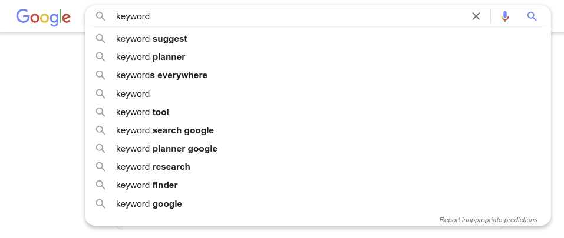
        </li>
        <li>
            <h4><b>Google Ads: Keyword Plan</b></h4>
            
Google Ads' Keyword Plan tool helps you compare search volumes and competition for keyphrases as well as generate new ideas for keywords.

            <a href="../tools/keyword_plan.md">Click here</a> for instructions to navigate to Keyword Plan

            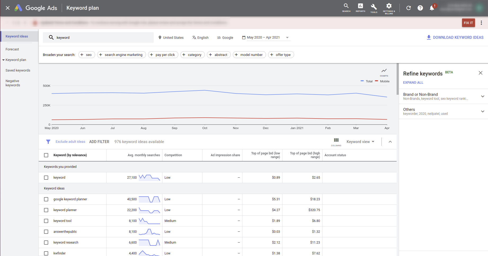
        </li>
        <li>There are may other tools you can google for to help with keyword selection.</li>
    </ul>

## Front-Load Title Modifiers

Details

 
    
Title tags help Google and other search engines understand what your website is about. Titles are also what the search engine returns in big blue letters when you search a word

Front loading just means put your keyphrase near or at the beginning of the title.

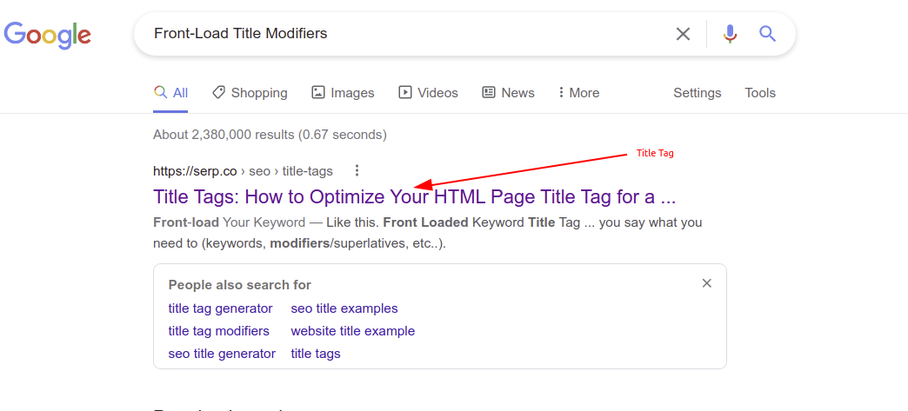

Google assumes that words and phrases coming sooner in your title have a higher priority and are more relevant to the content than words coming later. So if you want to rank for that keyword in search it is better to put it sooner in the title tag. Here are some examples for the search term "Front-Load keywords".  

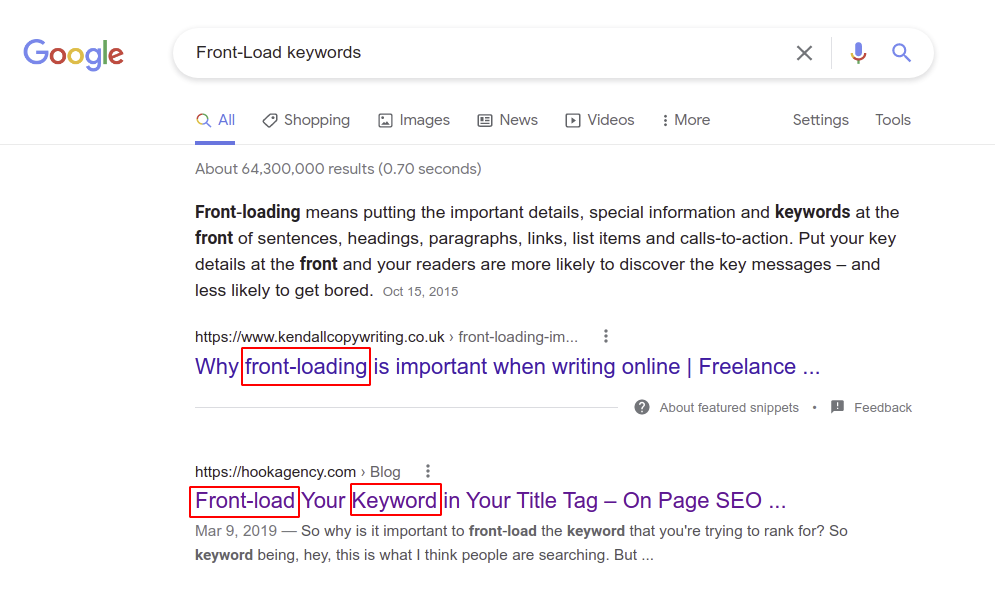

<h3>How To Set Titles in Wordpress</h3>
    <ul>
        <li>
            
Either create an new pager or post or navigate to an existing page or post to edit

        </li>
        <li>
            
In the "Add Title" section create a title

            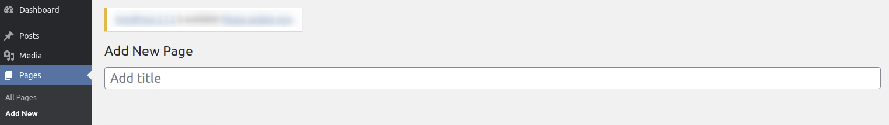
            
Example: Keyphrase = Front-Load Keywords

            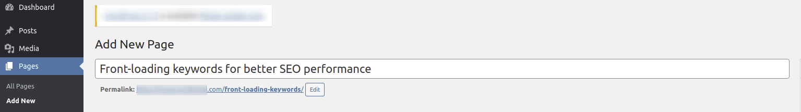
        </li>
        <li>
            
You can also modify the title using the Yoast plugin. Scroll down until you see the yoast plugin.

        </li>
        <li>
            
Once you find it. Click on the "SEO" tab.

        </li>
        <li>
            
Then Click on the "Edit Snippit" button

            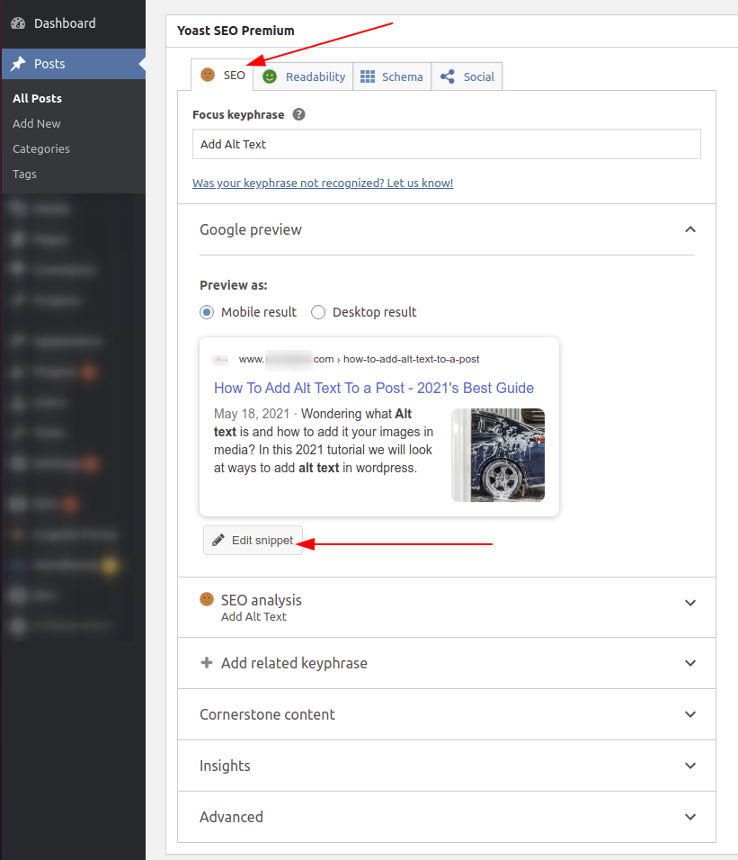
        </li>
        <li>
            
Then under the "SEO title" you can edit the title.

            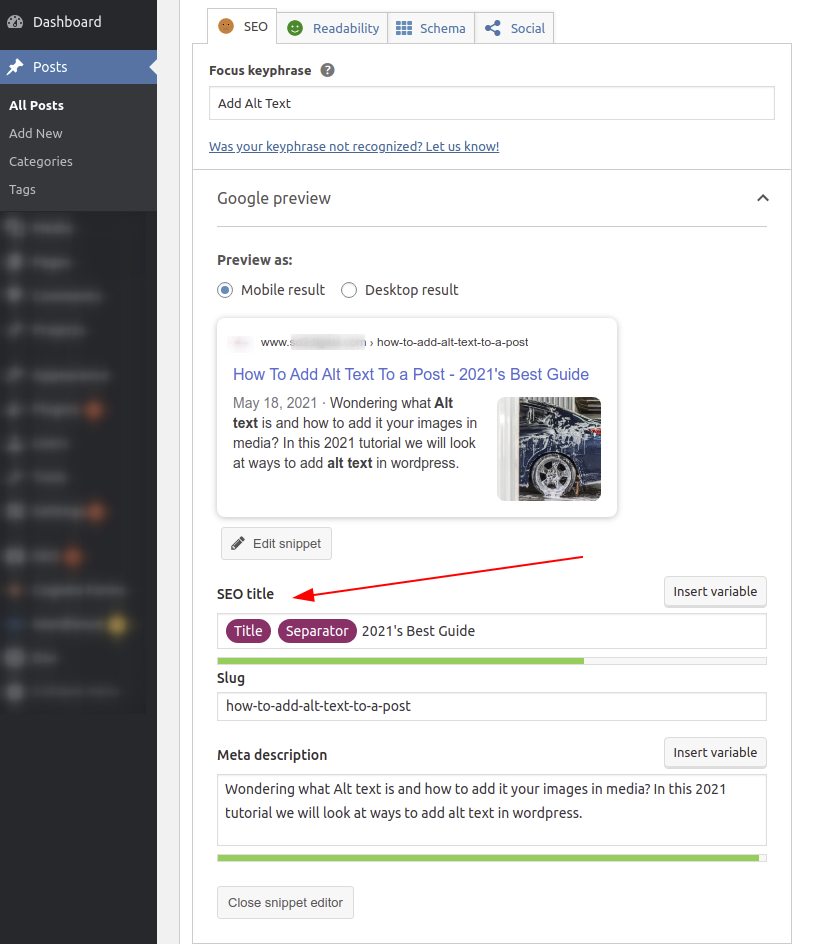
        </li>
    </ul>

## Add Meta Description

Details

 

The <a href="https://yoast.com/meta-descriptions/">meta description</a> is a snippet of up to about 155 characters – a tag in HTML – which summarizes a page’s content. Search engines show it in search results mostly when the searched-for phrase is within the description. -exert from yoast.com

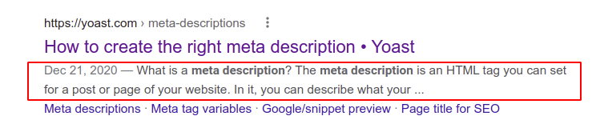
<h3>How To Set URLs in Wordpress</h3>
    <ul>
     <li>
            
While editing an post or page, scroll down until you see the yoast plugin.

        </li>
        <li>
            
Once you find it. Click on the "SEO" tab.

        </li>
        <li>
            
Then Click on the "Edit Snippit" button

            
        </li>
        <li>
            
Then under the "SEO title" you can edit the meta tag. You should include keywords or synonyms in the meta description.

            
        </li>
    </ul>

## Include Keyphrase in URL

Details

 
    

    We want our url to contain our keyphrase. So if your keyphrase is "front-load keywords" our url should at least contain the keywords. "www.examplecompany.com/front-load-keywords" would work. Your url can contain extra words but try to keep it concise. If this web page is under a sub category of the website such as blogs the url would look something like "www.examplecompany.com/blog/front-load-keywords"
    

<h3>How To Set URLs in Wordpress</h3>
    <ul>
        <li>
            
Wordpress trys to auto generate you a URL based off the title. If you title is relatively short and contains your keyphrase, then you are probably good to go. If it doesn't refactor your title to contain your keywords or shorten your URL while retaining the keywords. Do not have unnecessarily long URK=Ls (over 5-6 words).

            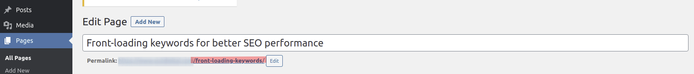
        </li>
        
    </ul>

## Embed Title Tag Modifiers

Details

 

Title Tag Modifiers are words that add detail to your title tag

If your site was a recipe site and the keyphrase was: "home-made pizza recipe " modifiers would be works or phrase like: best, 2021, in 5 steps, quick and easy, ect.

So the the entier title would could look like this:

<ul>
    <li>Best Home-Made Pizza Recipe</li> 
    <li>Home-Made Pizza: 2021's Best Recipie</li> 
    <li>Home-Made Pizza Recipe in 5 Easy Steps</li> 
</ul>

Adding modifiers can make your website rank for <a href="https://yoast.com/focus-on-long-tail-keywords/">long-tail keyphrases</a> but they also help your click through rate. These modifiers make your title more interesting am more likely to be clicked.

Would you click on "Pizza Recipe" or "Pizza Recipe: 2021's Most Delicious Recipe in 5 Steps

## Include Keyphrase In First 150 Words

Details

 

Make sure your keyphrase appears in the first 150 or so words of the content

Google scans the content of each web-page. If it doesn't see your keyword in the beginning it can be confused about what the topic of the content is.

If a speaker was on-stage for 30 minutes before he told you what the speech was about you would be confused. Don't do that with your content, let the read and google know right away what the page is about. 

## Include Keyphrase In h1 element

Details

 

HTML is the standard markup language for creating Web pages. In HTML, the h1 element is the top level heading of a web page similar to the title of an essay. For example the h1 element for this web page is &lt;h1&gt; Keyword and On-Page SEO Checklist &lt;/h1&gt;. Just like the title of a paper the h1 element tell the user and google what the web page is about. The h1 needs to include the keyphrase. There can be other words included with the keyphrase and the keyphase can even be reorder but make sure to include it.

<h3>How To Set URLs in Wordpress</h3>
   
In most causes the "Title" of the page or post will automatically become the H1. So include the keyphrase in the title.

## Each Page Can Only Have One h1 element

Details

 

Pages should only have one h1 element per page but you can have as many h2, h3, h4, ect elements as you would like. If you have multiple h1 google has a harder time figuring out what your page is about and this will negatively effect your ranking

The yoast plugin on wordpress will tell you if you accidentally made a page with multiple h1 elements. If you did, you can go back in the editor and delete the extra h1 or change it to an appropriate sub heading like an h2 or h3

    If you use the visual builder, the title will become the h1 tag. In the content area, make sure you only use headings of "Heading 2" or larger for all sub headings. If you use "Heading 1" it will create another h1 element and we only want one h1 element per page.
    

    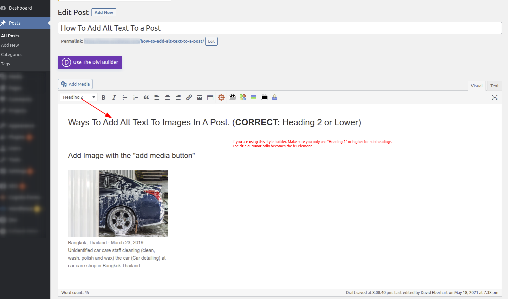
    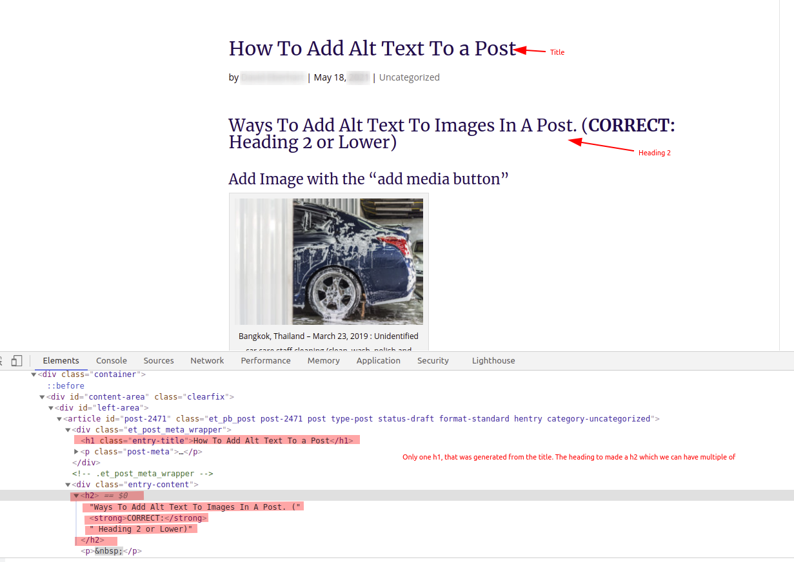

Occasionally yoast will tell you that you have multiple h1 elements when you don't. Here is a way to triple check

<ul>
    <li>Open Google Chrome</li>
    <li>Go to the url of the webpage Yoast says has multiple h1 element</li>
    <li>Once on the web page, right click anywhere on the page</li>
    <li>Click the Elements tab from the horizontal navigation bar</li>
    <li>Then click control+f on the keyboard to bring up a search box</li>
    <li>search for &lt;h1&gt;</li>
    <li>If the results show only 1 item you are good. If multiple show, find them and refactor the headers in wordpress</li>
</ul>

## User Keyphrase In h2 And h3 Tags If Practical

Details

 

If the h1 element is the title of a paper, h2 is the the title of the sub topics.

If practical, include the keyphase or parts of it or synonyms in the h2 and h3 tags

Never keyword stuff. This is when you put the keyword everywhere even in places it doesn't fit to try to increase you ranking for that keyword. 

This doesn't work and can actually <b>HURT YOU SEO</b>. Google can identify keyword stuffing and can lower your rank thinking your website is a span site trying to hack or cheat the system

Always choose heading and sub heading that best convey the message of the content to the user regardless of if it contains keywords.

## Make Sure Images Have Descriptive File Names

Details

 

When you load media: photo, videos, gif, ect into wordpress. It is best practice to have descriptive filename. Kebab case, all letters are written in lower case and the words are separated by a hyphen or minus sign is the standard naming format.

So this photo file name should be something like dog-chasing-tail.jpg not an auto generated name like FDGZmicro_20150424GettyImages_dv413023_MAIN (1).jpg and you should aviod spaces in file names like dog chasing tail.jpg 

Google does not have eyes, well at least not yet. So it uses the file names to gain insite about what media contains. Descriptive names help google understand what the photo is about as well as how it supports your content.

Plus it is just easy to find and navigate your media when it has human readable names.

Kebab case is the standard name formatting. Kebab case uses dashes where spaces would be so

## Add Alt Text To All Images That Are Not Soley Decorative

Details

 

Alt Text (also known as alternative text or alt attribute) is a text that accurately describes an image. It is added to the  tag in the HTML of a page. 

The alt text is not shown when a page is viewed in the browser but it becomes visible when an image cannot be loaded.

Search engine crawlers read the alt text value and screen readers use it to ‘describe’ the image to users who cannot see.

<h3>How To Add Atl Text To Images in Wordpress</h3>

There are multiple ways to do this depending on how you build the content. I will go over the one I know

<ul>
    <li>
        <h4>Add Media</h4>
       
Clicking the "add media" button will bring you to image options

       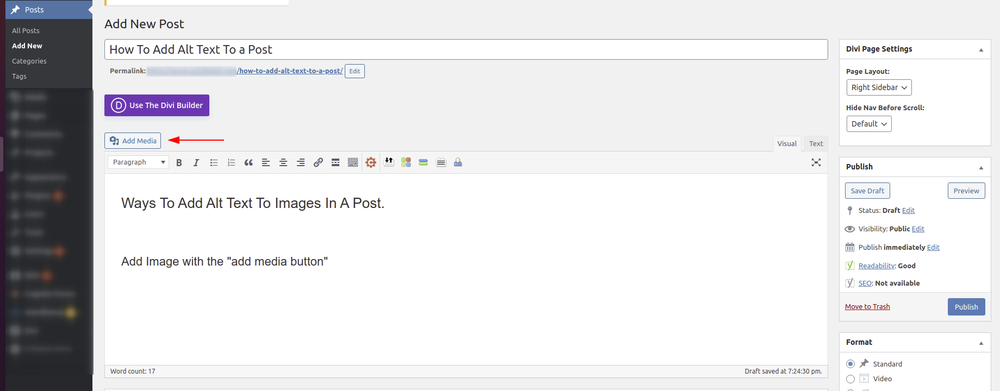
       
Then in the alt text box you can add alternet text.

       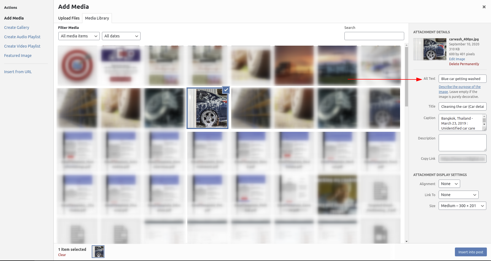
       
Now you can insert the photo.

    </li>
    <li>
        <h4>Editing Existing Photos' To add Alt Text</h4>
       
If a photo is already in a post or page using the visual builder, you can click on the image and then on the pencil icon to edit the detail.

        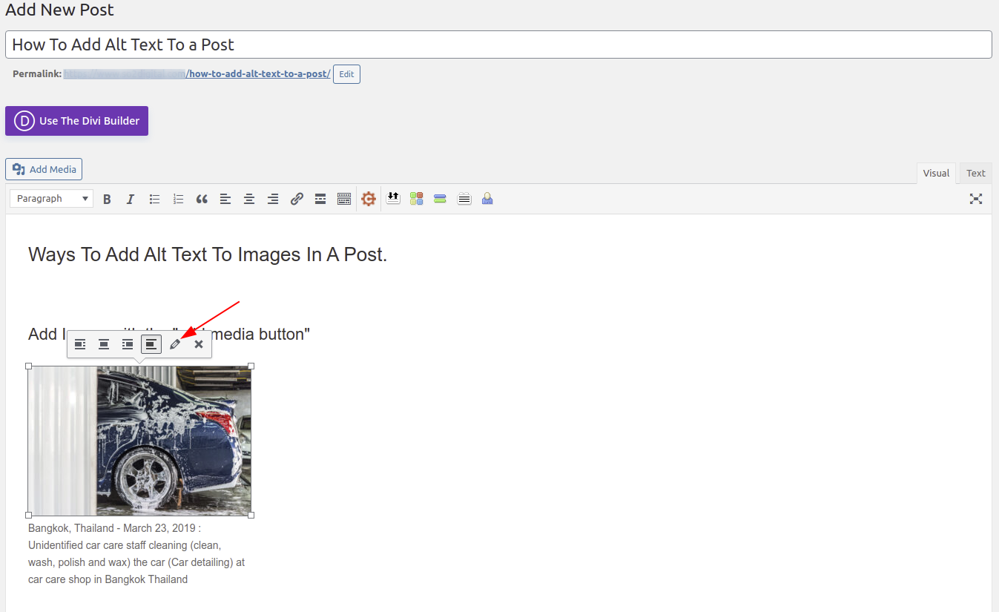
        
Add or Update the alt text and then click update to save the changes.

         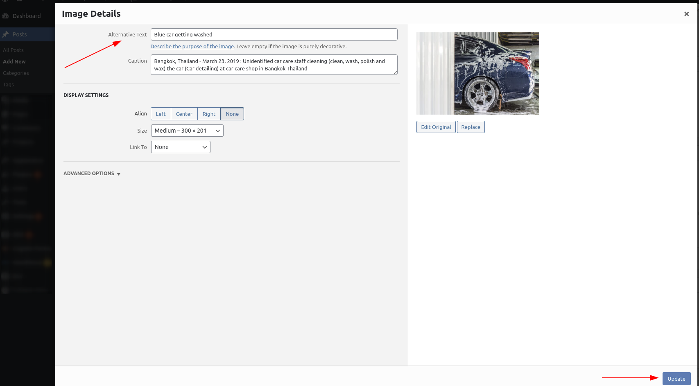
    </li>
    <li>
        <h4>Editing Alt Text For Photos in Divi Builder</h4>
        <ul>
            <li>Under the divi builder for the page you are working on. Find or insert an image</li>
            <li>
                
Click to more options button and then select "Modify Default Values"

                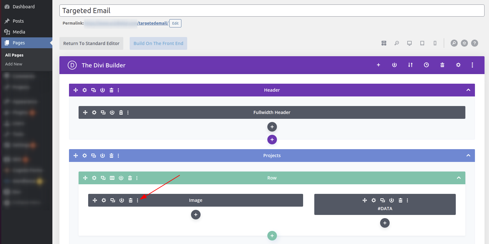
            </li>
            <li>
                
Exit out of the "Default Image" tab that pops up by clicking the red X at the bottom left

                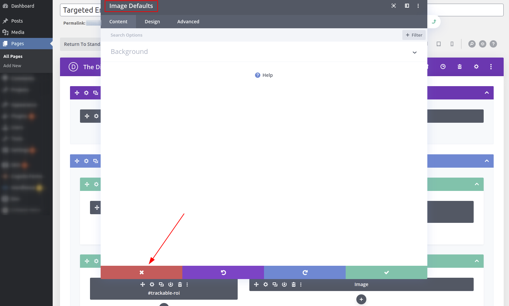
            </li>
            <li>
                
When the Image Setting page pops up, click the "Advanced" tab

                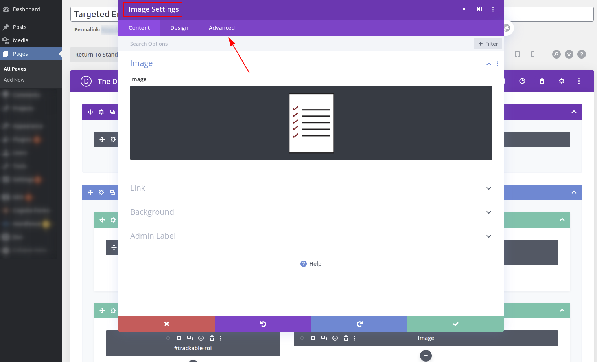
             </li>
             <li>
                
Click the "Attributes" tab and then the alt text box will appear. Add your alt text and click the green check to save

                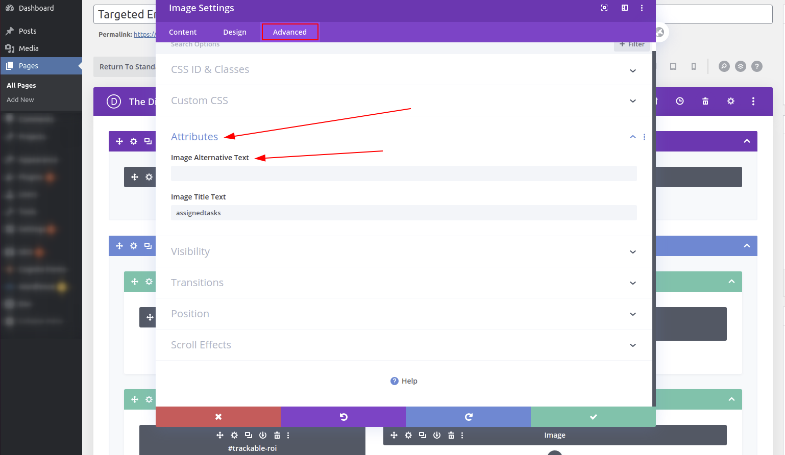
             </li>
             
If you use the "build on front end" build option, the steps to add alt text are similar to the divi builder

        </ul>
    </li>
</ul>

## Keyword Density, Synonyms and LSI Keywords In Content

Details

 

Make sure that we are organically using the keyword, synonyms, or <a  href="https://ahrefs.com/blog/lsi-keywords/">LSI keywords</a> thought the content. We don't have to go crazy but if the article is 1000 words, we would expect to see the keyword, synonyms  or lsi words 3-5 times

## Use External Links

Details

 

It is recommend to have external links to trusted site. So if you can link to wikipidia or a research study related to the the content it helps google know our content it quality and relying on trustworthy sources.

Good content often requires good sources. Naturally if you are realaying on trusted sources to support your content claims you would be able to provide them as reference. This is the though process behind having external links.

## Use Internal Links

Details

 

Internal links show how our pages are connected. It is good practice to link to other internal pages when they contain relevant but extend or more in-depth content related to our topic. Google looks at which pages have the most internal links pointing to them and assess those are our most important pages. 

