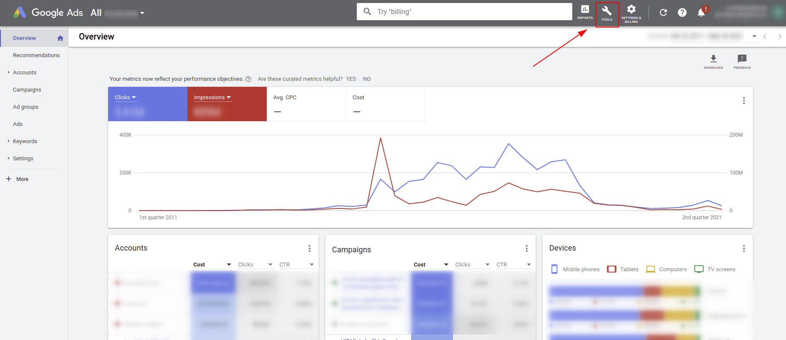
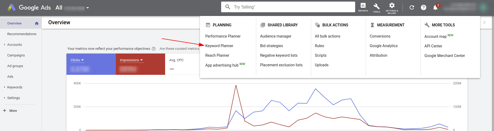
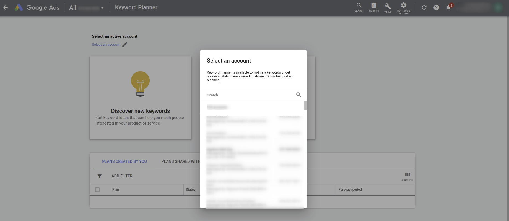
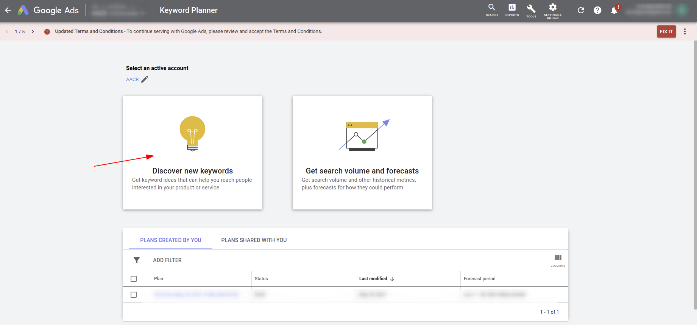
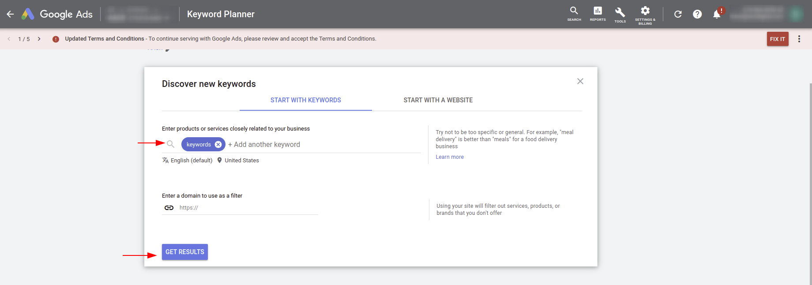

<h1>How To Navigate To Google Ads Keyword Plan</h1>

You will need your organization to add your email as one of their Google Ads users, inorder to access Google Ads or you will have to create an account. Creating an account does require a CC on file so I would try the prior first if its an option. 

<ol>
    <li>
    <h2>Sign In to <a href="https://ads.google.com/home/#!/">Google Ads</a>
    </h2>
    </li>
    <li>
        <h2>From the Dashboard, Click the "Tool" Icon in the horizontal navigation bar</h2>
        
    </li>
    <li>
        <h2>From the dropdown under "Planning" select "Keyword Planner"</h2>
        
    </li>
    <li>
        <h2>Select an Account</h2>
        
It does not matter what account we select. We just want to look as some keyword information not how it relates to an account but it does force you to select an account.

        
    </li>
    <li>
    <h2>Click Discover New Keywords</h2>
        
    </li>
    <li>
        <h2>Enter Starter Keywords</h2>
        
In the search tab, enter either possible keywords or things related to your product or desired search intent. Then click get results to see other suggestions as well as search volume and competition

        
    </li>
    <li>
        <h2>View the results</h2>
        
Take a look at the results. Remember <b>keyphrase</b> selection is important. Do your research before selecting a keyphrase. Ideally a keyphrase should have great <a href="https://backlinko.com/hub/seo/search-intent"><b>search intent</b></a>, high <b>search volume</b>, and <b>low competition</b>. You also need to consider how competitive your company can be for a key word and if you have already used that keyword elsewhere on your website. Check <a href="https://yoast.com/keyword-cannibalization/">keyword cannibalization</a> for more on repeated keyword use. Also make sure your keyword selection follows your companies keyword stratigy

    </li>
    
</ol>

